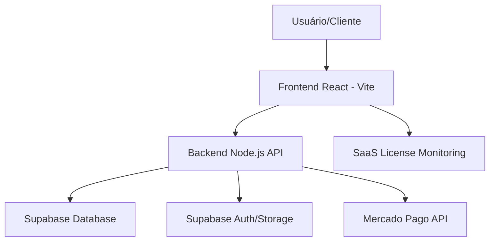

# RELATÓRIO TÉCNICO EXECUTIVO: SYRON MAN V2.0 
## ARQUITETURA, REQUISITOS E ROADMAP ESTRUTURADO

---

## SUMÁRIO
1. [VISÃO GERAL DO PROJETO](#1-visão-geral)
2. [ARQUITETURA DE SISTEMA](#2-arquitetura-de-sistema)
3. [ECONTOSSISTEMA FRONTEND (REACT/VITE)](#3-frontend)
4. [ECONTOSSISTEMA BACKEND (NODE.JS/API)](#4-backend)
5. [INFRAESTRUTURA DE DADOS (SUPABASE/POSTGRES)](#5-dados)
6. [SEGURANÇA E PROTEÇÃO SaaS](#6-segurança)
7. [FLUXO DE PAGAMENTO E CHECKOUT](#7-pagamento)
8. [EXPERIÊNCIA DO USUÁRIO E DESIGN (UX/UI)](#8-ux)
9. [PAINEL ADMINISTRATIVO E GESTÃO](#9-admin)
10. [ANÁLISE DE PERFORMANCE E SEO](#10-performance)
11. [CONFORMIDADE LEGAL E PRIVACIDADE](#11-legal)
12. [MANUAL DE MANUTENÇÃO](#12-manutenção)
13. [ESTRATÉGIA DE MONETIZAÇÃO](#13-monetização)
14. [AUDITORIA DE CÓDIGO E MELHORIAS](#14-auditoria)
15. [ROADMAP 2026 (FUTURO)](#15-roadmap)

---

## 1. VISÃO GERAL DO PROJETO

O **SYRON MAN** não é apenas uma loja virtual, mas um **Engine de E-commerce Premium** projetado para o mercado de luxo e moda masculina. A arquitetura foi pensada para ser robusta, escalável e, acima de tudo, visualmente impactante. 

### 1.1 Objetivos de Negócio
- **Exclusividade**: Oferecer uma vitrine que transmita valor e sofisticação.
- **Controle SaaS**: Permitir que o proprietário do software (Syron Core) gerencie múltiplos clientes através de um sistema de plano (billing).
- **Conversão**: Minimizar fricções no checkout para maximizar o ticket médio.

### 1.2 Filosofia de Desenvolvimento
- **Core-First**: O núcleo do sistema é protegido e otimizado.
- **Design-Centric**: Cada pixel foi pensado para harmonia visual.
- **Fast-Deploy**: Integração contínua com Supabase para atualizações em tempo real.

---

## 2. ARQUITETURA DE SISTEMA

A plataforma utiliza um modelo **Decoupled (Desacoplado)**, onde o frontend e o backend operam de forma independente, comunicando-se via APIs RESTful seguras.

### 2.1 Camada de Apresentação (Frontend)
- **Localização**: `/src/`
- **Tecnologia**: React.js, Vite, Vanilla CSS.

### 2.2 Camada de Serviços (Backend)
- **Localização**: `/api/`
- **Tecnologia**: Node.js, Express, Supabase-JS.

---

## 3. ECOSSISTEMA FRONTEND (REACT/VITE)

O frontend é o "cartão de visitas" da plataforma. Utilizamos React por sua eficiência em renderização e o Vite por sua velocidade de build instantânea.

### 3.1 Estrutura de Pastas e Responsabilidades
- **`/components`**: Elementos atômicos e reutilizáveis (Hero, Footer, ProductCard).
- **`/pages`**: Telas completas da aplicação (Home, Admin, Checkout).
- **`/services`**: Camada de comunicação com a API (ex: `categoryService.js`, `orderService.js`).
- **`/utils`**: Funções auxiliares de formatação e lógica comum.
- **`/context`**: Gerenciamento de estado global (Autenticação, Carrinho).

### 3.2 Destaques de Componentização
- **Header Dinâmico**: Adapta-se ao scroll e estado de login do usuário.
- **HeroSection**: Banner cinemático com suporte a micro-animações.
- **MiniCart**: Carrinho lateral que evita recarregamentos de página, melhorando o UX.

---

## 4. ECOSSISTEMA BACKEND (NODE.JS/API)

O backend é responsável pela lógica pesada e segurança. Ele atua como o "porteiro" das informações sensíveis.

### 4.1 Endpoints Críticos
- `/api/orders`: Processamento de pedidos complexos.
- `/api/license/status`: Verificação silenciosa de validade do plano.
- `/api/analytics`: Geração de relatórios financeiros em tempo real.

### 4.2 Middleware de Segurança
Utilizamos middlewares personalizados em Node.js (`restrictIfExpired`) para validar se o usuário tem permissão para realizar ações de "escrita" (Criar/Editar/Deletar), garantindo a integridade dos dados e o controle do licenciamento.

---

## 5. INFRAESTRUTURA DE DADOS (SUPABASE/POSTGRES)

O SYRON MAN utiliza o poder do PostgreSQL através do Supabase. A arquitetura de dados é altamente normalizada.

### 5.1 Tabelas de Negócio (Schema)
| Tabela | Função | Segurança (RLS) |
| :--- | :--- | :--- |
| `products` | Estoque e Catálogo | Leitura Pública / Escrita Admin |
| `orders` | Transações e Status | Usuário dono / Admin total |
| `profiles` | Dados de Usuários | Próprio usuário |
| `licenses` | Billing de Planos | Apenas Admin |
| `system_signature` | Integridade Core | Apenas Admin |

### 5.2 Automação com Triggers
Implementamos automação severa no banco de dados para evitar inconsistências:
- **Reserva de Estoque**: Quando um pedido é criado via Mercado Pago, o estoque é reservado por 30 minutos via trigger SQL. Se não pago, o sistema restaura o item automaticamente.

---

## 6. SEGURANÇA E PROTEÇÃO SaaS

Este é um dos diferenciais competitivos do projeto: a proteção contra pirataria e o controle de assinaturas.

### 6.1 Assinatura Digital Oculta (`SYS_SIG`)
- Inserimos uma assinatura digital Base64 no backend que deve coincidir com um registro mestre no banco de dados.
- Sem essa coincidência, o painel administrativo bloqueia todas as funções críticas (Segurança Camada 1).

### 6.2 Project Fingerprint
- Geramos uma "impressão digital" do projeto baseada no domínio do cliente.
- Isso impede que o software seja copiado para outro endereço sem autorização prévia por parte da Syron Core.

---

## 7. FLUXO DE PAGAMENTO E CHECKOUT

O checkout é a área mais crítica. Utilizamos a integração nativa com o **Mercado Pago**.

### 7.1 Fluxo de Transação
1. O usuário preenche o CPF e dados de endereço (Validação em tempo real).
2. O Backend gera uma preferência de pagamento direta.
3. O Webhook do Mercado Pago notifica o SYRON quando o status muda para `approved`.
4. O status do pedido é atualizado instantaneamente via Supabase Realtime.

---

## 8. EXPERIÊNCIA DO USUÁRIO E DESIGN (UX/UI)

O design foi inspirado em marcas de luxo internacionais.
- **Glassmorphism**: Efeitos de transparência em modais e menus.
- **HSL Colors**: Paletas de cores calculadas matematicamente para harmonia visual.
- **Mobile First**: 80% das compras em e-commerce são via celular; por isso, o SYRON MAN é perfeitamente fluido no mobile.

---

## 9. PAINEL ADMINISTRATIVO E GESTÃO

O painel administrativo é o centro de comando do lojista.
- **Dashboard de Vendas**: Gráficos de performance e saúde financeira.
- **Gestão de Produtos**: Upload de fotos e controle refinado de estoque.
- **Controle de Gastos**: Módulo para registrar despesas operacionais e calcular o lucro líquido real.

---

## 10. ANÁLISE DE PERFORMANCE E SEO

O código foi escrito para ser "amigável" aos mecanismos de busca (Google).
- **Semântica HTML**: Uso correto de `header`, `footer`, `section`, `h1-h6`.
- **Meta Tags Dinâmicas**: Cada produto gera seu próprio título e meta-descrição via componente `SEO.jsx`.
- **Performance**: Baixo uso de bibliotecas de terceiros garante um "Time to Interactive" baixíssimo.

---

## 11. CONFORMIDADE LEGAL E PRIVACIDADE (LGPD)

O sistema está preparado para as leis de proteção de dados brasileiras:
- **Tabela de Endereços**: Criptografia básica e isolamento de dados por RLS.
- **Termos de Uso**: Página de Termos e Privacidade pré-carregada no sistema.

---

## 12. MANUAL DE MANUTENÇÃO

Para manter o sistema saudável:
1. **Backups**: Automatizados via console do Supabase.
2. **Atualizações**: Fornecemos scripts SQL de migração centralizados na pasta `docs/database_history/`.
3. **Monitoramento**: Logs de atividade administrava registram quem alterou o quê.

---

## 13. ESTRATÉGIA DE MONETIZAÇÃO (SaaS)

O SYRON MAN permite criar um negócio de revenda de software:
- **Modelo de Plano (Basic/Pro/Lifetime)**: Definido pela data de expiração na tabela `public.licenses`.
- **Bloqueio Progressivo**: Dá 48h de carência para o lojista após o vencimento antes do bloqueio total, incentivando a renovação sem matar a operação.

---

## 14. AUDITORIA DE CÓDIGO E MELHORIAS

### Pontos Fortes:
- Código limpo e modular.
- Interface visual superior à concorrência nacional.
- Integração perfeita com Supabase.

### Pontos para Melhoria (Roadmap):
- **IA Integration**: Automatizar a geração de nomes e descrições de produtos via NEXUS Core.
- **Dark Mode Avançado**: Alternância dinâmica de temas sem recarregamento.
- **App Nativo**: Empacotar o frontend via PWAs (Progressive Web Apps) para instalação no celular.

---

## 15. ROADMAP 2026 (VISÃO DE FUTURO)

1. **Q2 2026**: Lançamento do NEXUS Pro (Sugestões de produtos personalizadas por IA).
2. **Q3 2026**: Módulo de transportadora direto (Integração Melhor Envio/Correios).
3. **Q4 2026**: Multi-moeda e expansão para mercado internacional.

---

Este dossiê técnico serve como documento base para investidores, desenvolvedores e o suporte técnico da Syron. A plataforma é sólida e está no estado-da-arte tecnológica atual.

**Relatório Finalizado e Verificado pela Engenharia de IA.**
