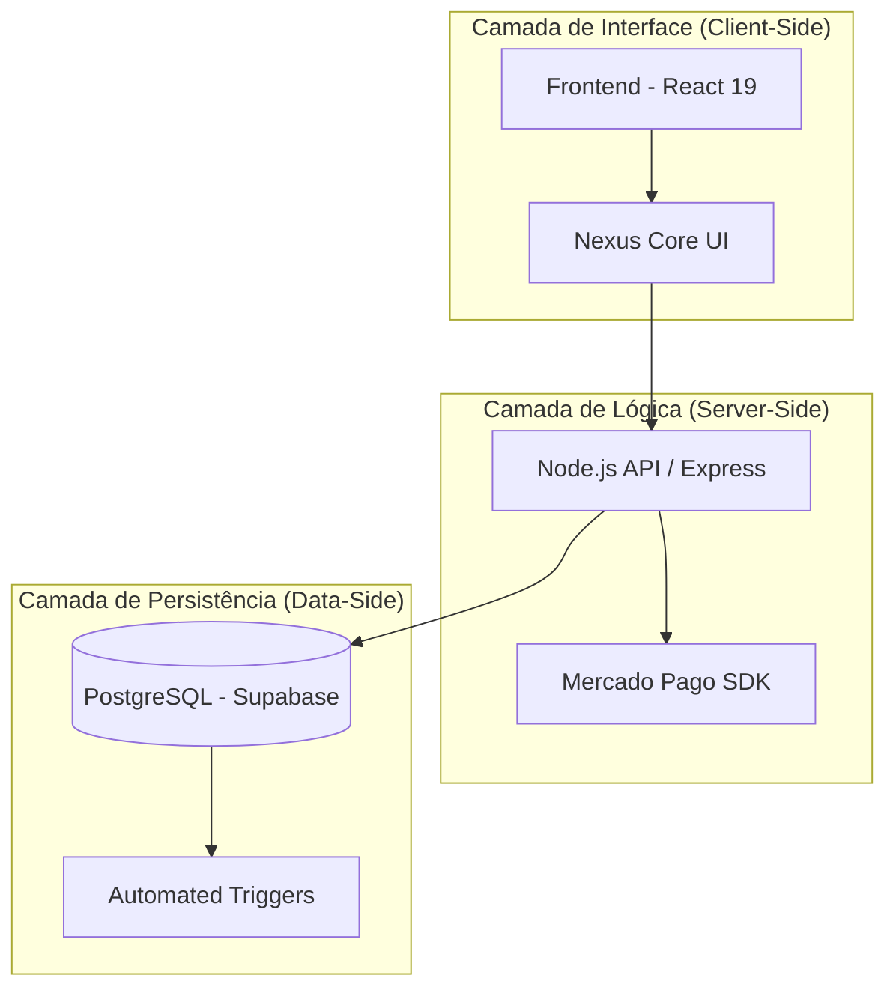
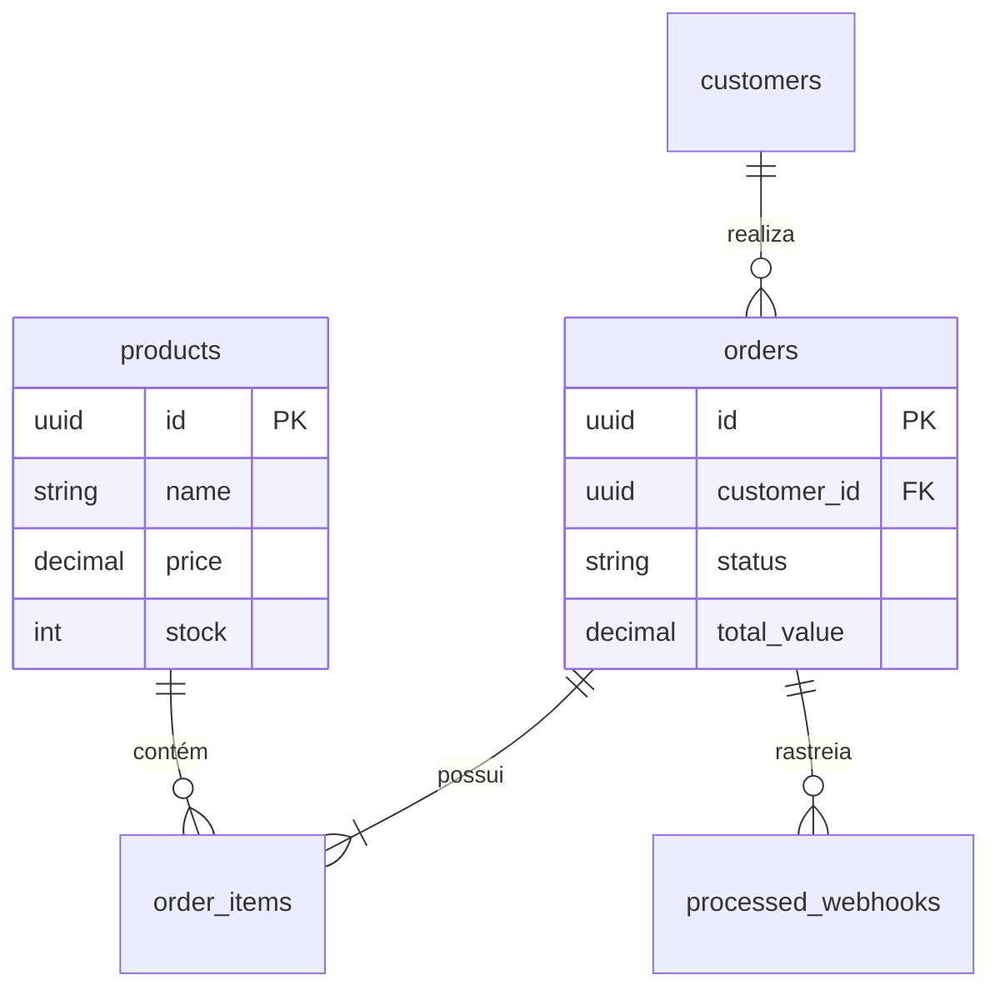

# Relatório do Sistema: SYRON MAN 📄

## 🏗️ Introdução

O sistema **SYRON MAN** é uma plataforma de e-commerce premium voltada para o público masculino. O projeto foi desenvolvido com o objetivo de oferecer uma experiência de compra sofisticada, combinada com automação avançada de processos operacionais, incluindo controle de estoque, registro financeiro e análise de dados.

## 🎯 Objetivo do sistema

O objetivo principal do sistema é fornecer uma plataforma de comércio eletrônico robusta e escalável, capaz de gerenciar produtos, pedidos, pagamentos e clientes de maneira automatizada, garantindo eficiência operacional e alta qualidade na experiência do usuário.

## 🧠 Arquitetura do sistema

A arquitetura do sistema é baseada em uma estrutura modular composta por frontend, backend e banco de dados. O frontend é responsável pela interface de interação com o usuário, enquanto o backend gerencia as regras de negócio e a integração com serviços externos, como gateways de pagamento. O banco de dados centraliza as informações relacionadas a produtos, pedidos e clientes.

## ⚙️ Tecnologias utilizadas

O sistema foi desenvolvido utilizando tecnologias modernas que priorizam desempenho, escalabilidade e experiência do usuário.

*   **Frontend:** O frontend foi desenvolvido utilizando **React 19** e **Vite**, proporcionando carregamento rápido e renderização eficiente da interface.
*   **Backend:** O processamento de regras de negócio é realizado por um servidor **Node.js** com framework **Express**, garantindo rapidez na comunicação entre frontend e banco de dados.
*   **Banco de Dados:** O banco de dados utiliza **PostgreSQL** por meio da plataforma **Supabase**, oferecendo suporte a consultas avançadas, segurança e escalabilidade.

## 🗄️ Banco de dados

O banco de dados foi projetado para garantir integridade, rastreabilidade e automação de processos. Cada pedido realizado gera registros nas tabelas de pedidos e itens do pedido, mantendo um histórico completo das transações realizadas no sistema. A lógica de estoque é integrada ao banco de dados, permitindo atualizações em tempo real a cada transação confirmada.

## 🔒 Segurança

Para garantir segurança e privacidade dos dados, o sistema utiliza políticas de **Row Level Security (RLS)**, restringindo o acesso às informações conforme o perfil do usuário. Além disso, foi implementado um modelo de controle de acesso baseado em funções (**RBAC**), permitindo a definição de diferentes níveis de permissão entre administradores e clientes.

## 🚀 Funcionalidades

O sistema oferece diversas funcionalidades voltadas para a gestão eficiente da loja virtual, incluindo:

*   Catálogo de produtos premium com filtros dinâmicos.
*   Carrinho de compras persistente.
*   Checkout integrado com gateways de pagamento (Mercado Pago).
*   Controle automático de estoque com proteção contra duplicidade (Idempotência).
*   Painel administrativo com métricas de vendas e gráficos de performance.

## 🖥️ Infraestrutura

A infraestrutura do sistema foi projetada para garantir alta disponibilidade e escalabilidade. O frontend é hospedado em ambiente de **edge computing**, garantindo baixa latência global, enquanto o backend e o banco de dados são gerenciados pela plataforma **Supabase**, aproveitando serviços de cloud de alto desempenho.

## 📊 Status atual

Atualmente, o sistema encontra-se em fase de estabilização operacional, com todas as funcionalidades principais implementadas e testadas. Os fluxos de checkout, pagamento e atualização automática de estoque estão funcionando de forma consistente, com suporte a processamento de webhooks em tempo real.

## 🔮 Roadmap

As próximas etapas do projeto incluem:
1.  Implementação de recursos avançados de análise de dados por meio de inteligência artificial (**NEXUS Intelligence**).
2.  Expansão do sistema de personalização da interface administrativa (**Visual Customizer**).
3.  Automação completa da geração de relatórios financeiros em PDF.

---
*Relatório emitido pelo núcleo de engenharia do sistema.*
